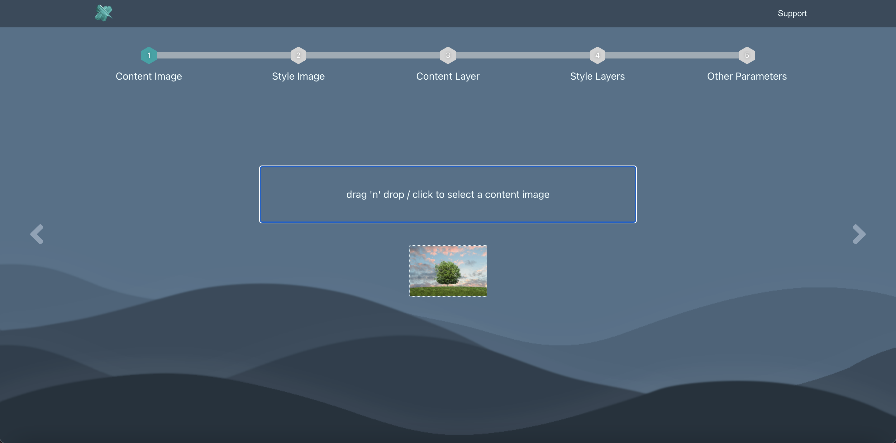
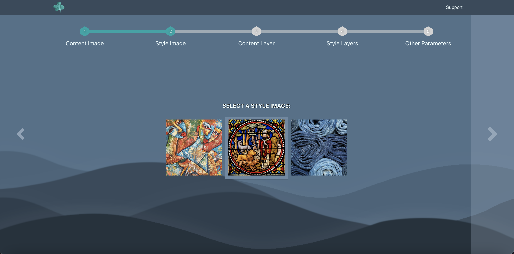
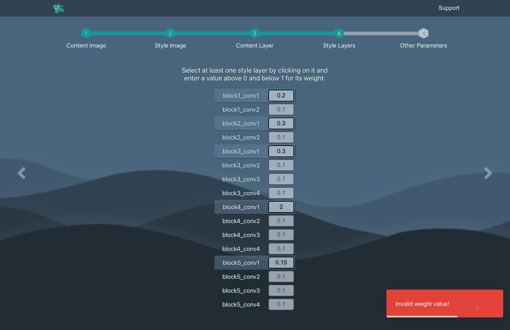
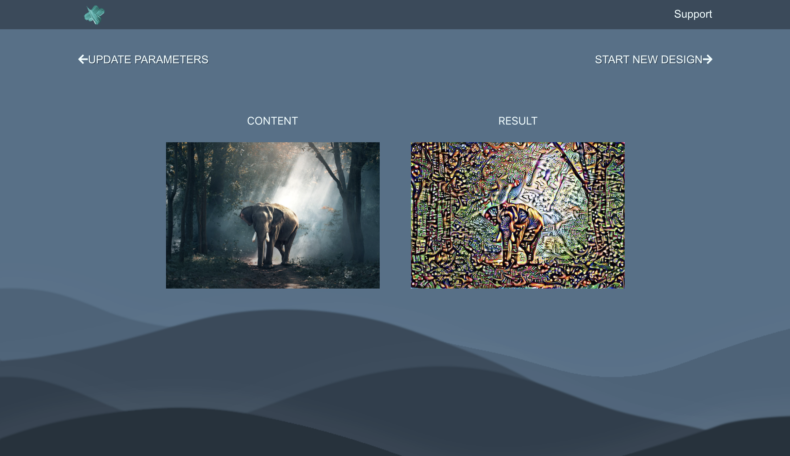

# Image Style Transfer

Web app for investigating image style transfer with VGG19. Built as a BSc Computer Science final year project 2020/2021. This tool lets the user pick the layers and weights used for the style and content. 

### Run Application
TERMINAL 1 - frontend: \
`yarn start` \
TERMINAL 2 - backend: \
`yarn start-api` 

### Run Database
You need to have MongoDB installed to run a local MongoDB server from `<path_to_your_mongodb>/mongodb/bin`. 

TERMINAL 3 - invoke command line options: \
`./mongod` (to specify data folder add: ` --dbpath=<path_to_mongodb_data>/data/db`) \
TERMINAL 4 - run single server db: \
`./mongo` 

### DB Script
PyMongo script to create the database: \
`python3 .../api/data/database.py`

### Test
Launch the test runner in interactive watch mode: \
`yarn test`

### Tech Stack
- Python backend
- Flask API
- React JS, SCSS frontend
- MongoDB, PyMongo database

### Result Examples

### Application Screenshots

